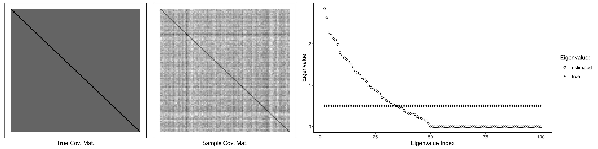
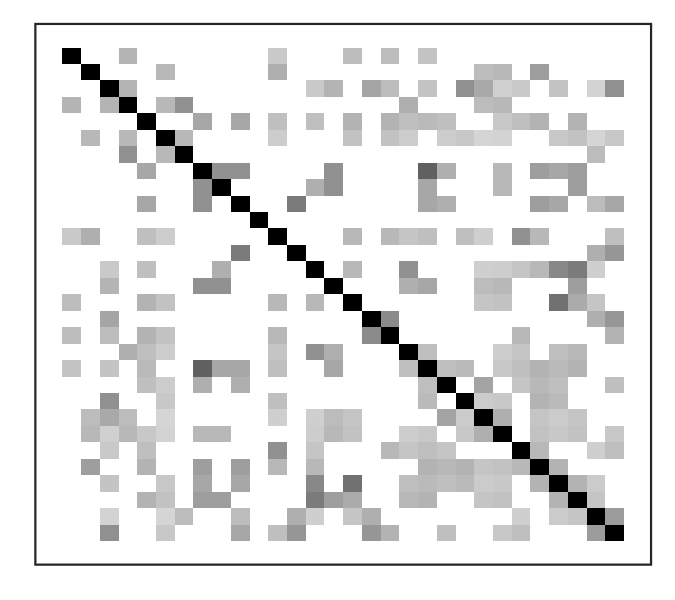
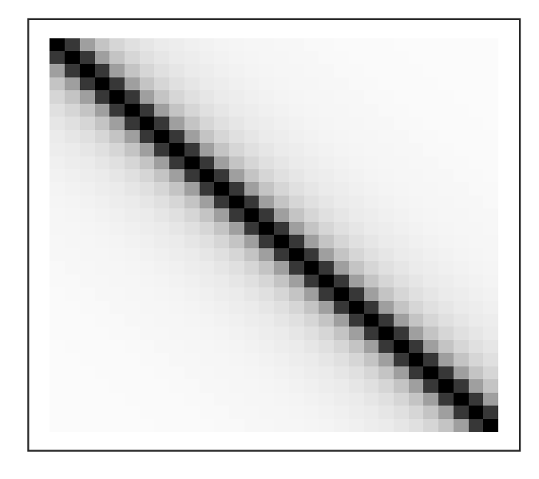
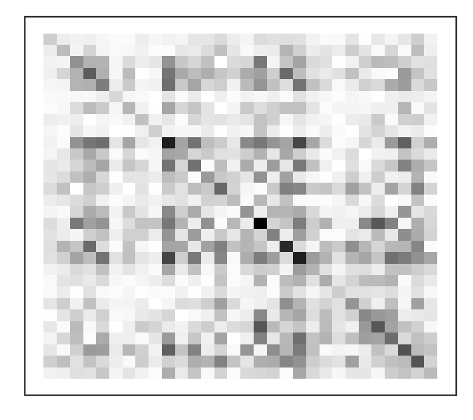
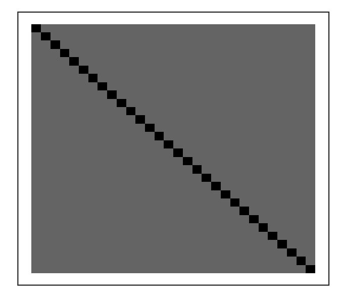
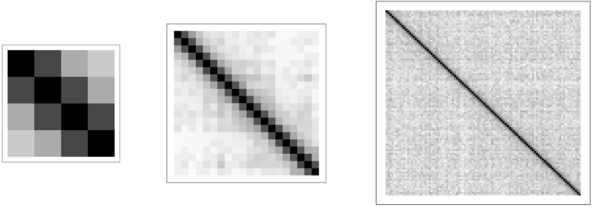
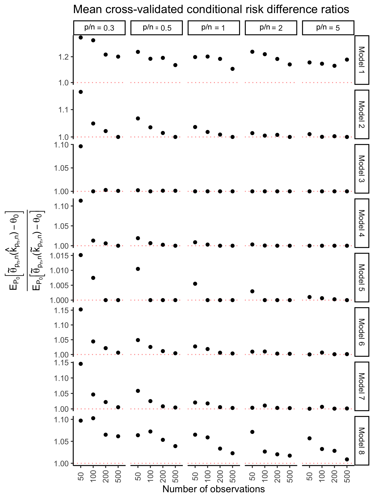
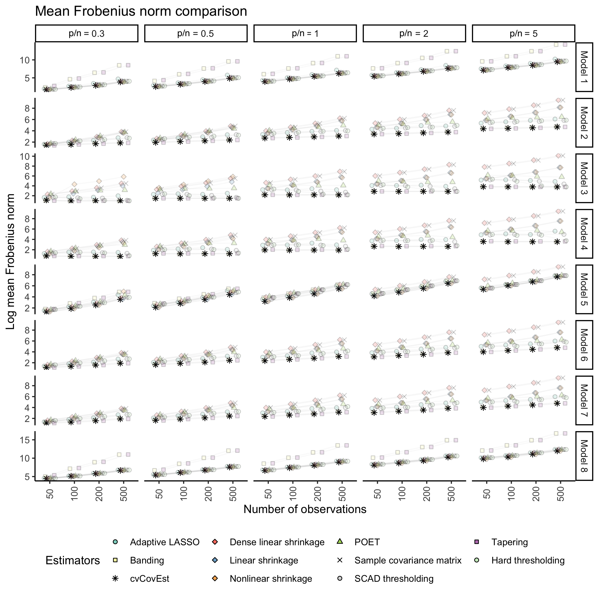

<style>

.remark-slide-content > h1 {   font-size: 35px;   margin-top: -88px; }


.center2 {
  margin: 0;
  position: absolute;
  top: 50%;
  left: 50%;
  -ms-transform: translate(-50%, -50%);
  transform: translate(-50%, -50%);
}

</style>

```{r load_refs, include=FALSE, cache=FALSE}
library(RefManageR)
BibOptions(
  check.entries = FALSE,
  bib.style = "numeric",
  cite.style = "numeric",
  style = "markdown",
  hyperlink = FALSE,
  max.names = 1,
  longnamesfirst = FALSE
)
my_bib <- ReadBib("references.bib", check = FALSE)
```

# Why Estimate the Covariance Matrix?

This parameter plays central roles in many exploratory and inferential
procedures: 
  
+ Exploration of dependence structure between features
+ Dimensionality reduction
+ Low rank approximations
+ Feature clustering
+ Confidence regions
+ Latent factor estimation
+ Tests for (multivariate) shifts in variability

--

However, the covariance matrix is rarely known *a priori*. Its estimates
must be used instead.

---
class: left, top

# Estimating Covariance Matrices in High Dimensions

Let $\mathbf{X}_{n \times p} = \{X_1, \ldots, X_n: X_i \in \mathbb{R}^p\}$ be a
dataset of $n$ i.i.d. random vectors. Let $X_i \sim P_0 \in \mathcal{M}$, where
$P_0$ denotes the true data-generating distribution, and $\mathcal{M}$ is a
nonparametric statistical model. Our goal the estimation of
$\psi_0 \equiv \text{Var}[X_i]$.

--

When $n >> p$, the sample covariance matrix is the covariance matrix
estimator of choice. Not so when $n \approx p$, or $n < p$.

???

Why is the sample covariance matrix favoured? Ease of computation,
(assuming that it's correctly scaled) is the MLE for multivariate Gaussian data,
and is asymptotically consistent under the sufficient conditon is a bounded
fourth moment (not too many outliers). Worth noting, however, that Stein had
studied this in the 70s and 80s, showing that, like the multivariate mean
parameter for p > 3, it was possible to improve upon this estimator by
regularizing the eigenvalues of the sample covariance matrix.

However, we start encountering problems in high dimensions:
- highly variable, even though it's unbiased
- poor condition number, or singular, leading to poor results when it needs to be inverted
- eigenvectors are typically inconsistent to true covariance matrix eigenvectors
- eigenvalues are very biased (see example)

--

.center[


*The sample covariance applied to 50 realizations of $X \sim \mathcal{N}(0, \Sigma_{100 \times 100})$.*
]

???

Note that the first eigenvalue is removed from the rightmost plot.

---
class: left, top

# Alternative Estimators

Thankfully, researchers have developed estimation strategies to address the
sample covariance matrix's shortcomings.

--

.pull-left[
**Sparse Covariance Matrix** `r Citep(my_bib, c("bickel2008b", "rothman2009"))`


]

???

- Proposed by Bickel and Levina in a 2008 paper. Expanded on by Rothman in 2009
  with more general regularization function.
- *Assumes "approximate sparsity", which is to say that a non-negligeable*
  *portion of entries are small or zero. Consistency is achieved in high*
  *dimensions so long as p does not grow much faster than n and that the DGP is*
  *Gaussian (or subgaussian).*

--

.pull-right[
**Tapered Covariance Matrix** `r Citep(my_bib, c("bickel2008a", "cai2010"))`


]

???

- Another proposition of Bickel and Levina from 2008. In fact, believe that the
  two papers came out in the same issue of Annals of Statistics. Expanded upon
  by Cai et al. in the following years.
- *Assumes a fairly rigid structure: distant features (temporal or spatial) are*
  *assumed to be independent. Under similar conditions to the sparsity-assuming*
  *estimators, consistency is achievable if p is not much larger than n*
  *asymptotically. Not all that surprising, not many parameters.*

---
class: left, top

# Alternative Estimators (Continued)

.pull-left[
**Latent Factor Covariance Matrix** `r Citep(my_bib, c("fan2013", "fan2018"))`


]

???

- First proposed by Fan and others in 2013, these estimators assume that the
  leading factors of the sample covariance matrix reflect the actual covariance
  matrix, and that the rest constitute noise.
- Can be thought of as the low-rank approximation of the sample covariance
  matrix, in which the latter eigevectors are regularized
  (usually by summing their outerproducts and then thresholding before summing
  with leading eigenvectors).

--

.pull-right[
**Empirical Bayes Approach** `r Citep(my_bib, c("ledoit2004", "ledoit2020"))`


]

???

- Inspired by Stein / Empirical-Bayes. Estimators are typically convex
  combinations of the sample covariance matrix and a target matrix. Potential
  targets include the identity, and the dense covariance matrix. Most popular
  target is the identity, as it shrinks the eigenvectors towards the grand mean,
  thereby guaranteeing positive definiteness of the estimates.
- Recent work proposed non-linear shrinkage estimators wherein eigenvalues of
  the sample covariance matrix are shrunk towards the modes of their empirical
  distribution. 

---
class: left, top

# Which Estimator Should We Use?

Stringent assumptions about the true covariance matrix are typically impossible
to verify:

+ How sparse is the true covariance matrix?

--

+ Are "distant" features truly independent?

--

+ How many latent factors are present, if any?

--

+ Which target matrix is most appropriate?

--

.center[

]

???

- No surprise that most people stick to the sample covariance matrix anyways!
- These structural considerations are but one of the required assumptions about
  the data generating distribution when choosing an estimator! We need a
  general,objective, data-driven approach to covariance matrix estimator
  selection.

---
class: left, top

# Loss-Based Estimator Selection Framework

The Loss-Based Estimation (LBE) framework proposed by
`r gsub(", (?=et al\\.)", " ", Citet(my_bib, "laan-dudoit2003"), perl=TRUE)`:

1. Define the statistical model and estimand

???
Identify the details of the problem and set a goal.
--

2. Identify candidate estimators

???
What tools can you use to accomplish you task?
--

3. Choose an appropriate loss function

???
Need a metric by which to evaluate the performance of these tools. Want a
measurement that relates the estimates to the target parameter for the observed
data.
--

4. Estimate the candidate estimators' risks using cross-validation (CV)

???
We'd like the to compute the loss function's associated risk to get an aggregate
measure of performance -- i.e. compare the estimates to the true parameter
value. Of course, this isn't possible, so we instead estimate the risk using CV.
Recall that CV consists of intereatively paritioning the data into training and
validation sets, where the estimators are fit on the training data, and then
aggregate performance is computed over over the validation set.
--

5. Select the CV risk minimizer for the estimation procedure

???
Simply choose the estimator to use for the estimation task as the one that
minimizes the CV risk.

Give example of estimating the mean DNAm beta at a specific CpG site in a
population.

--

Under somewhat nonrestrictive assumptions, the CV selection performs just as
well as the selection one would make if the data generating distribution were
known
`r gsub(", (?=et al\\.)", " ", Citep(my_bib, "laan-dudoit2003"), perl=TRUE)`.

???

There are some general conditions, such as having a "well-behaved" loss, such
that the true parameter minimizes the risk under $P_0$. Generally, however, the
conditions vary from estimation problem to estimation problem. We'll discuss the
conditions in more detail for the covariance matrix estimation problem in a bit.

---
class: left, top

# Applying Lost-Based Estimation

Only a few obstacles stand in the way of applying the LBE framework to this
high-dimensional covariance matrix estimation problem:

--

1. Derive an appropriate loss function

???

- The most popular loss function used in the literature is probably the
  Frobenius loss of the difference between the sample covariance matrix and the
  estimate.
- Asymptotic behaviour


--

2. Extended the theoretical results to the high-dimensional setting:
Both $n, p \rightarrow \infty$, and $p/n \rightarrow c > 0$ asymptotically.

???

Need to make some minor tweaks to make sure that the theoretical results still
hold for this setting. Essentially, allowing for finite-sample corrected
results. In fact, that's the motivation high-dimensional (AKA Kolmogorov)
asymptotics: make asymptotic arguments in finite samples. Otherwise, the sample
covariance matrix would maintain its optimality.

Let's discuss this loss function first.

---
class: left, top

# The Observation-Level Frobenius Loss Function

Define the covariance matrix for any $P \in \mathcal{M}$ as
$\psi \equiv \Psi(P)$. Then the parameter space is defined as
$\boldsymbol{\Psi} \equiv \{\psi = \Psi(P): P \in \mathcal{M}\}$. The
observation-level Frobenius loss function is then defined as

$$
\begin{split}
  L(X; \psi) & \equiv \left\lVert XX^\top - \psi \right\rVert^2_{F} \\
  & = \sum_{j=1}^p \sum_{l=1}^p \left(X^{(j)}X^{(l)} - \psi^{(jl)}
    \right)^2
\end{split}
$$

for any $\psi \in \boldsymbol{\Psi}$, $X \sim P \in \mathcal{M}$.

???

Mention that risk minimizer associated with this loss is identical to that of
the traditional Frobenius norm-based loss that employs the sample covariance
matrix instead of the outer product of a single random observation. As such, the
associated risk also informs on the accuracy of the average eigenvalues for a
given estimator.

--

The traditional Frobenius loss is defined as
$$
L_{trad}(S_n(\mathbf{X}); \psi) \equiv \lVert S_n(\mathbf{X}) - \psi \rVert_F^2,
$$
where $\mathbf{X}$ is an $n \times p$ matrix of random vectors, and $S_n(\cdot)$
is the sample covariance matrix.

---
class: left, top

# Sumary of Results

The expected risk difference of our procedure is bounded for fixed $n$ and $p$
by the expected risk difference of the oracle and an error term.

--

1. The entries of all $\psi \in \boldsymbol{\Psi}$ are bounded.

--

2. For each $P \in \mathcal{M}$ and $X \sim P$, the elements of $X$ are bounded
  almost surely.

--

Then, asymptotically in $n$, $p$ and $p/n \rightarrow c > 0$, the oracle's and
the cross-validated selection's performances converge so long as the oracle's
risk difference increases at a rate faster than $p$.

--

.center[



]

???

As $p$ grows, the salient structural patterns become more obvious. Put another
way, the correct bias-variance trade-off becomes more obvious.

I have another slide with explicit high-dimensional asymptotic results, if
interested.

---
class: left, top

# Simulation Study

.pull-left[



]

--

.pull-right[

- Each point is made up of 300 datasets.
- 74 individuals estimators are included in the library.
- Optimal average selection is achieved when ratio is equal to $1$.
- For large enough $n$ and $p$, optimal selection (on average) is driven by
  $p$.
- Similar results for full dataset risk difference ratios (i.e. convergence in
  probability).

]

---
class: left, top

# Simulation Study (Continued)

.center[



]

???

Another way of looking at our method is to compare our CV procedure to all the
candidate estimators that make it up. As you can see, the cvCovEst method
performs as well as teh best estimator across the board.

---
class: left, top

# The cvCovEst Package

This method is implemented in the peer-reviewed `cvCovEst` `R`
`r Citep(my_bib, "rstats")` package:

+ A stable version is made availble on `CRAN` at https://CRAN.R-project.org/package=cvCovEst
+ A development version is
available on GitHub at https://github.com/PhilBoileau/cvCovEst
+ Twelve classes of estimators are implemented, along with three different loss
  functions.
+ A suite of plotting tools and summary methods is included.
+ A tutorial is provided in the accompanying vignette. 
+ Open an issue on GitHub to suggest additional estimators.

---
class: middle, center, inverse

# Conclusion

---
class: left, top

# References

```{r refs_1, echo = FALSE, results='asis'}
PrintBibliography(my_bib, start = 1, end = 5)
```

---
class: left, top

# References

```{r refs_2, echo = FALSE, results='asis'}
PrintBibliography(my_bib, start = 6, end = 9)
```

---
class: left, top

# References

```{r refs_3, echo = FALSE, results='asis'}
PrintBibliography(my_bib, start = 10, end = 10)
```

---
class: middle, center, inverse

# Questions?
pboileau.ca
